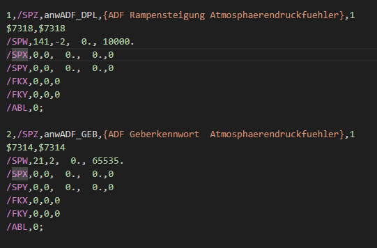
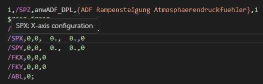

# dam-language-support

The goal of this VSCode extension is to make it easier to read DAM files
generated by the ancient ETAS VS100 software.

## Features

This plugin offers rich syntax highlighting for the DAM format.

The plugin also offers hover tips for known directives.

## Known Issues

As of now, the meaning of the directives is not parsed by the extension. We're
working on this but this area is not well documented.

## Release Notes

### 1.0.0

Initial release of dam-language-support